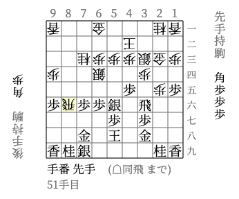
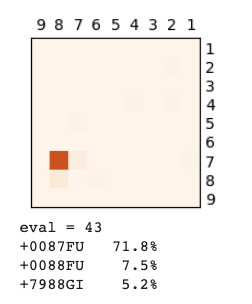

# miniOSL

Python interface to [OSL (open shogi library)](https://gps.tanaka.ecc.u-tokyo.ac.jp/gpsshogi/index.php?GPSshogi), refurbished and enhanced by C++20 with pybind11 for cooperation with numpy and pytorch. 

WIP.

## demo@colab

[https://colab.research.google.com/drive/1orT32kOR58owC0SfhPdC0yodFdn8h2nX?usp=share_link](https://colab.research.google.com/drive/1orT32kOR58owC0SfhPdC0yodFdn8h2nX?usp=share_link)

| `shogi.go(50)`            | `value, moves = shogi.eval()` |
|:-------------------------:|:-----------------------------:|
|  |       |

## pip wheel

- [https://pypi.org/project/miniosl/](https://pypi.org/project/miniosl/)

## work with source code

- C++20 (tested with g++ 12.2.1 in `manylinux_2_28`, Apple clang 14.0.3)
- Python 3.10+
- cmake 3.22+

typical commands
- `git clone --recursive https://github.com/tkaneko/miniosl.git`
- `cd miniosl`
- `pip3 install -e .`
  - example for envvar: `CMAKE_BUILD_PARALLEL_LEVEL=4` `CXX=g++-12`
