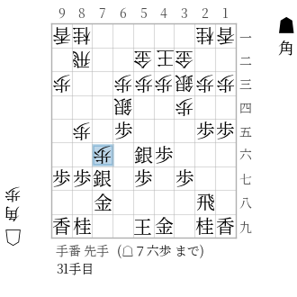

miniosl
===============

.. automodule:: miniosl

.. autoclass:: miniosl.UI
    :members:

Training with torch
-------------------
       
.. autoclass:: miniosl.StandardNetwork
    :show-inheritance:
    :members:
    :undoc-members:

.. autoclass:: miniosl.GameDataset
    :show-inheritance:
    :members:
    :undoc-members:

Handle game records
-------------------
see also :ref:`minioslcc:Game record` section, :py:class:`MiniRecord` and :py:class:`RecordSet` 

.. autofunction:: miniosl.load_record_set

Visualization
-------------------

.. autofunction:: miniosl.state_to_img

.. autoclass:: miniosl.ShogiFig
    :members:

Use external engines
---------------------

.. autoclass:: miniosl.UsiProcess
    :members:

.. autoclass:: miniosl.UsiPlayer
    :members:

.. autoclass:: miniosl.CPUPlayer
    :members:

